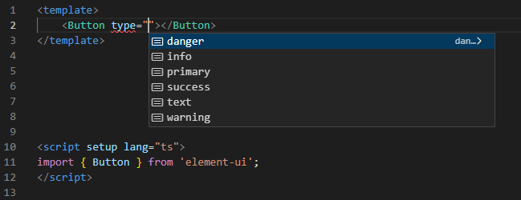
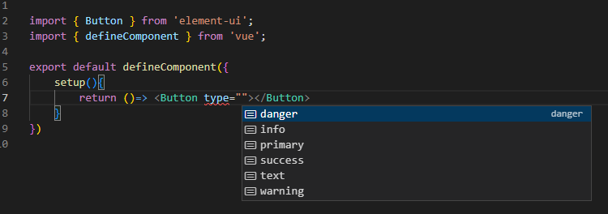
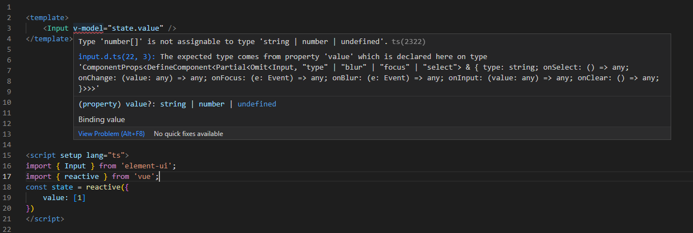

Use this types library,Youe can get `correct type derivation` when use element-ui,it can cover element-ui's types export.

# install
`yarn add element-ui-cover`

# tsconfig
Add flow config in your tsconfig.json.
```js
{ 
 "compilerOptions": {
    "types": [
      "element-ui-cover"
    ], 
  },
  ...others,
}
```

# result view
### for template (with vscode plugin Volar)
tsconfig.json add config at flow:
```js
{ 
 "vueCompilerOptions": {
    "extensions": [
      ".vue"
    ],
    "target": 2.7
  },
  ...others,
}
```


### for tsx
- The [@vue/babel-preset-jsx](https://github.com/vuejs/jsx-vue2) transition property `scopedSlots` to slots,so the slots use `scopedSlots`;


### type error


# peerDependencies
vue and element-ui is required.
- vue version ^2.7.0
- element-ui version ^2.0.0