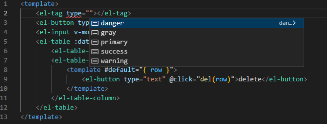
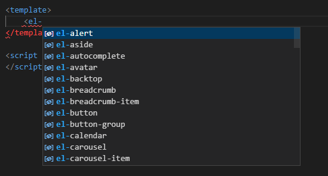
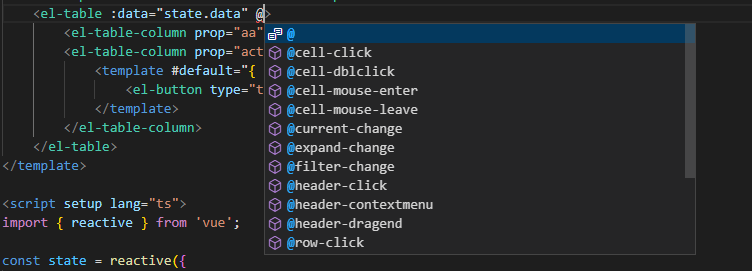
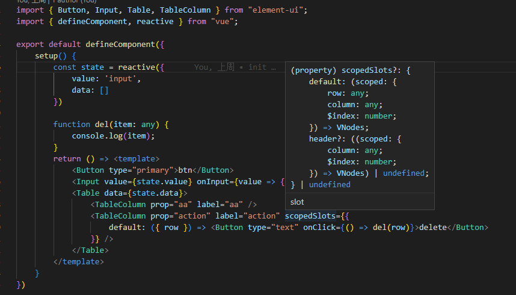

- [中文说明](https://github.com/cx690/element-ui-cover/blob/main/README_zh_CN.md "中文说明")
- Use this types library,Youe can get `correct type derivation` when use element-ui,it can cover element-ui's types export.

# install
`yarn add element-ui-cover --dev`

# tsconfig
Add below config in your tsconfig.json.
```js
{ 
 "compilerOptions": {
    "types": [
      "element-ui-cover"
    ], 
  },
  ...others,
}
```

# result view
### for template (with vscode plugin Volar)
tsconfig.json add config as below:
```js
{ 
 "vueCompilerOptions": {
    "target": 2.7
  },
  "compilerOptions": {
      "types": [
      "element-ui-cover"
      ]
  },
  ...others,
}
```


### for global components (with vscode plugin Volar)
If element-ui components is registered as global components, set config as below:
- Add types in tsconfig.json
```js
{ 
  "vueCompilerOptions": {
    "target": 2.7
  },
 "compilerOptions": {
    "types": [
      "element-ui-cover",
      "element-ui-cover/component.g.d.ts"
    ], 
  },
  ...others,
}
```
Then it will work:



Some events is also supported.


### for tsx
- The [@vue/babel-preset-jsx](https://github.com/vuejs/jsx-vue2) transition property `scopedSlots` to slots,so the slots use `scopedSlots` (but the Volar use `$scopedSlots`,this is a problem);



### type error


# peerDependencies
vue and element-ui is required.
- vue version ^2.7.0
- element-ui version ^2.0.0 (^2.15.0 is better)
