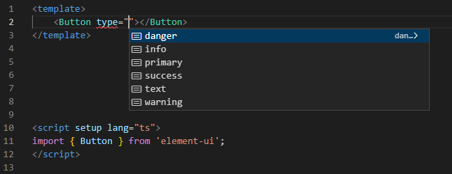
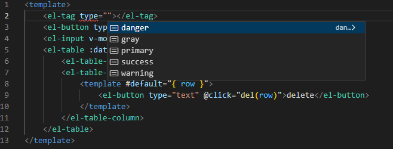
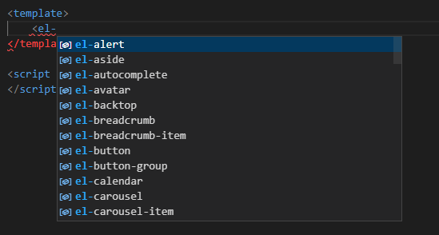
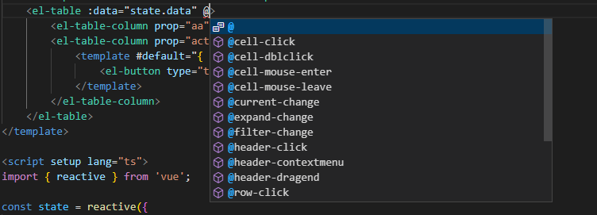
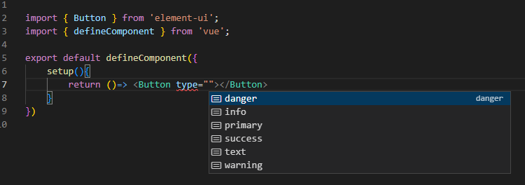
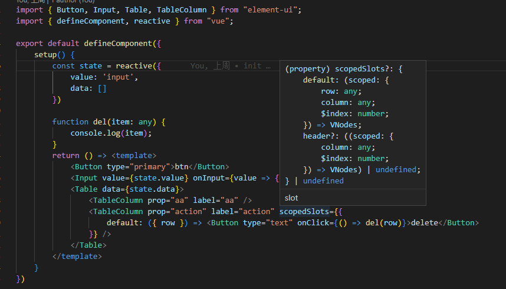
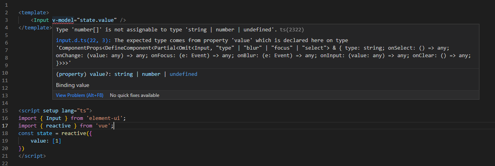
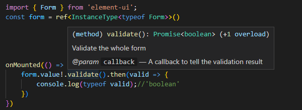

使用此类型库，你可以从element-ui中获取正确的类型推导，这个会覆盖element-ui的部分类型导出。

# 安装
`yarn add element-ui-cover --dev`

# tsconfig 配置
在tsconfig.json中增加以下配置：
```js
{ 
 "compilerOptions": {
    "types": [
      "element-ui-cover"
    ], 
  },
  ...others,
}
```

# 结果预览
### 对于模板语法 (需要使用 vscode 的插件 Volar)
tsconfig.json 中需要增加以下配置：
```js
{ 
 "vueCompilerOptions": {
    "target": 2.7
  },
  "compilerOptions": {
      "types": [
      "element-ui-cover"
      ]
  },
  ...others,
}
```


### 对于全局组件 (需要使用 vscode 的插件 Volar)
如果element-ui被注册为全局组件使用，按照以下设置即可：
- 在tsconfig.json中增加types设置：
```js
{ 
  "vueCompilerOptions": {
    "target": 2.7
  },
 "compilerOptions": {
    "types": [
      "element-ui-cover",
      "element-ui-cover/component.g.d.ts"
    ], 
  },
  ...others,
}
```
然后就可以正常使用了:



甚至部分事件也有支持


### 对tsx语法
- 由于 [@vue/babel-preset-jsx](https://github.com/vuejs/jsx-vue2) 转换属性 `scopedSlots` 为插槽,所以内部插槽使用了 `scopedSlots` 属性声明(但是Volar使用`$scopedSlots`,这是个问题);



### 类型错误


### ref 获取实例类型


# peerDependencies 预依赖
vue和element-ui两个库是必须的。
- vue version ^2.7.0
- element-ui version ^2.0.0 (^2.15.0 以上会更好)
